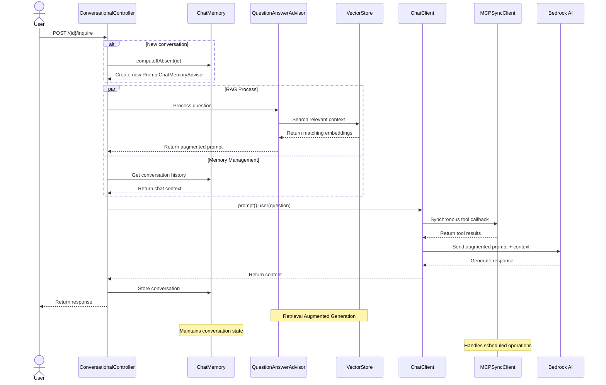

# Sample: Spring AI with Bedrock and MCP

A Spring Boot application that provides an AI-powered dog adoption service using:
- AWS Bedrock for AI/ML capabilities
- Spring AI for conversation management
- PostgreSQL with pgvector for vector storage
- Two services:
    - Adoptions service: Handles dog adoption inquiries
    - Scheduling service: MCP Server that manages adoption appointments

## Architecture



## Setup

To run locally you will need:
- JDK 23 or higher
- Docker

1. Setup Bedrock in the AWS Console, [request access to Nova Lite and Cohere Embed Multilingual](https://us-east-1.console.aws.amazon.com/bedrock/home?region=us-east-1#/modelaccess)
1. [Setup auth for local development](https://docs.aws.amazon.com/cli/v1/userguide/cli-chap-authentication.html)

Build the Scheduling MCP Server as a Docker container:
```
cd scheduling && ./mvnw spring-boot:build-image && cd ..
```
Alternatively, for faster MCP server startup, create a GraalVM Native Image container:
```
cd scheduling && ./mvnw -Pnative spring-boot:build-image && cd ..
```

## Running

This sample includes tests and a "test" main application which will start the dependency services (postgres with pgvector and the scheduling MCP server) in Docker with Testcontainers.

First make sure you are in the `adoptions` directory:
```
cd adoptions
```

Run the tests:
```
./mvnw test
```

Run the "adoptions" server:
```
./mvnw spring-boot:test-run
```

With the server started you can now make requests to the server.
In IntelliJ, open the `resources/client.http` file and run the two requests.
Or via `curl`:
```
curl -X POST --location "http://localhost:8080/2/inquire" \
    -H "Content-Type: application/x-www-form-urlencoded" \
    -d 'question=Do+you+have+any+neurotic+dogs%3F'
```
